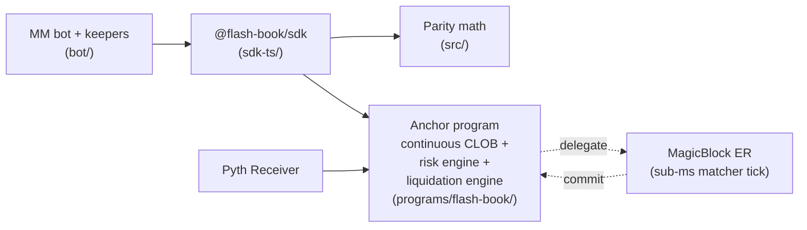

# Flash Book

An open-source perpetual futures DEX on Solana. Continuous CLOB on a
hypertree, formally-defined risk engine, and a comprehensive primitive
library covering every order type and risk control a top-tier perp
exchange ships.

**Devnet.** Not audited. Not production-ready.
Program ID `5VqBguVaSj8PH6BTk9X5s3nJCHRqAkZfB7G7Bjenzcq`
(see `Anchor.toml`).

```
cargo build-sbf                     clean
cargo test -p flash-book             571 tests pass (lib + integration + proptests + wave-integration)
bun test                             236 tests pass (TypeScript SDK + parity ports)
```

---

## What's in the box

```
programs/flash-book/   on-chain Solana program (Rust + Anchor)
sdk-ts/                TypeScript client (PDA + ix builders + IDL)
bot/                   reference MM bot + keeper suite
src/                   TypeScript parity ports of the on-chain risk modules
docs/                  architecture, math, audit, deployment docs
tests/                 TypeScript test suite
```

## Status snapshot

| Surface | State |
|---|---|
| Matching engine | Continuous CLOB on hypertree, integration-tested |
| Risk engine | H-haircut + A/K/F/B indices + per-slot envelope + stress lattice |
| Order types | Limit, market, IOC, FOK, post-only, trigger (stop/TP), TWAP, iceberg, bracket OCO, JIT liquidation |
| Margin modes | Cross + isolated with strict bucket independence |
| Liquidation | JIT auction + Dutch reward + per-position cooldown + dual-source price gate |
| Anti-MEV | Self-trade prevention (3 policies), VPIN-gated FLP, vol-adaptive oracle band |
| Decentralization | Authority-burn ladder |
| Internal audit | 19 audits, 4 findings remediated (see `docs/AUDIT.md`) |
| External audit | **Not yet engaged** |
| Mainnet | **Not deployed** |

## Architecture at a glance



Detailed diagrams (system, account ownership, fill flow, liquidation
pipeline, A/K/F/B settlement): [`docs/DIAGRAMS.md`](docs/DIAGRAMS.md).

## What this is

A Solana program that implements a perpetual futures orderbook with:

- **Hypertree-backed continuous CLOB** — single `MarketBook` PDA backed
  by a custom red-black tree; sub-ms account access on the matcher
  hot path via raw byte slicing (no Anchor deserialization).
- **Risk engine built on three Percolator-derived invariants**:
  - **H-haircut** — junior-claim PnL gating. Solvency-preserving by
    construction; profitable extractions bounded above by protocol
    Residual. See [`docs/HAIRCUT_MATH.md`](docs/HAIRCUT_MATH.md).
  - **A/K/F/B side indices** — lazy O(1) per-position settlement.
    Mark / funding / ADL / bankruptcy advance as cumulative indices;
    positions settle on touch.
  - **Per-slot envelope** — initialization-time proof that the
    configured `max_price_move_bps × dt + funding_budget` cannot push
    a position past `maintenance_bps + liq_fee_bps` for any notional.
    Bad-parameter markets cannot instantiate.
- **Stress-lattice scenario margin** — 13-scenario CME SPAN-style
  worst-case margin assessment per `assess_margin`. Combined with the
  three invariants above and tiered + OI-scaled MMR.
- **Comprehensive order-type library** — 16 distinct order types /
  modifiers including peg orders, MIT, trailing stops, stop-limit,
  conditional-cancel, min-fill-size, reduce-only, OCO brackets.
- **Anti-MEV defenses** — VPIN toxicity gating on FLP, vol-adaptive
  oracle band, ARG (Aggressor Roundtrip Guard) sandwich tax,
  pro-rata fill split.
- **Open authority-burn ladder** — `burn_market_authority` permanently
  relinquishes per-market authority. One-way state change; the market
  becomes fully decentralised.

See [`docs/FEATURES.md`](docs/FEATURES.md) for the complete primitive
matrix (23 pure-math modules, 14 on-chain ix added in the latest push).

## How Flash Book compares

Honest head-to-head against the major perp DEXes (full detail in
[`docs/COMPARISON.md`](docs/COMPARISON.md)):

| Capability | Hyperliquid | Drift v2 | dYdX v4 | GMX V2 | Phoenix | **Flash Book** |
|---|---|---|---|---|---|---|
| Matching | continuous CLOB (L1) | DLOB + JIT + vAMM | CLOB (mempool) | LP pool (no book) | CLOB | **continuous CLOB (hypertree)** |
| Risk math | linear haircut | risk buckets | tier MMR | OI-scaled MMR | n/a | **stress lattice + H + A/K/F/B + envelope** |
| Liq mechanism | HLP vault | keeper bots | keeper bots | flat-fee keeper | n/a | **JIT auction + Dutch reward** |
| Liq price gate | mark (TWAP blend) | MMR breach | MMR breach | oracle | n/a | **dual-source `worse-of(mark, oracle)`** |
| Cooldown | not documented | none | none | none | n/a | **per-position cooldown_slots** |
| Funding cadence | hourly | hourly | hourly | continuous borrow + funding | n/a | **per-block cumulative index** |
| Cross margin | yes | asset weights | yes | no | n/a | **stress-lattice cross + strict iso bucket** |
| Isolated margin | yes | yes (some spillover) | yes | n/a | n/a | **yes, formally independent buckets** |
| Sub-accounts | yes | yes | yes | session keys | n/a | **yes (Phase 2c–2f, distinct Position PDAs)** |
| Oracle | internal aggr. | partial | Chainlink Data Streams | Chainlink Data Streams | n/a | **median-of-3 + dispersion gate + envelope** |
| Open source | partial | yes | yes | yes | yes | **yes (Apache 2.0)** |
| Mainnet record | billions in OI | hundreds of millions | hundreds of millions | hundreds of millions | live (spot) | **devnet only** |

Where Flash Book leads on design (combination doesn't exist elsewhere):

1. **The Percolator triplet** — H-haircut + A/K/F/B + per-slot envelope.
   No shipped perp DEX has any of the three; Flash Book has all three
   wired on-chain.
2. **Stress-lattice + OI-scaled MMR** — scenario margin combined with
   crowded-trade penalty. GMX V2 has OI scaling; nobody pairs it with
   a scenario lattice.
3. **JIT-liquidation auction (open)** — any maker can underbid the
   synthetic close. HLP is the closest analogue (single vault); Flash
   Book's auction is competitive.
4. **acceptable_price slippage cap on triggers + TWAP** — gappy fills
   structurally impossible. GMX V2 has this for swap routes; Flash
   Book has it for the full trigger surface.
5. **Authority-burn ladder** — permanent, per-capability
   decentralization. Rare on perp DEXes; Flash Book ships it from
   day one.

Where Flash Book demonstrably loses (today):

- **Battle-testedness** — Hyperliquid has years and billions in OI;
  Flash Book is devnet-only with no real-money flow.
- **Speed** — Hyperliquid's in-consensus orderbook at ~70 ms median
  is unmatched. Flash Book runs at Solana slot time (~400 ms) on the
  base layer; MagicBlock ER targets 10–50 ms but is unverified in
  production on this branch.
- **External audit** — Hyperliquid / Drift / dYdX / GMX V2 / Phoenix
  all have multiple audits. Flash Book has internal audit only.

## What this is NOT

Called out explicitly:

- **No mainnet deployment.** Devnet only. Mainnet is gated on external
  audit + the operational items in
  [`MAINNET_READINESS.md`](MAINNET_READINESS.md).
- **No independent security audit.** Internal audit (19 audits across
  logic + security + math correctness) documented in
  [`docs/AUDIT.md`](docs/AUDIT.md) with 4 findings remediated. External
  audit recommended before any meaningful capital.
- **No HLP-style dedicated backstop vault.** The FLP is an LP pool, not
  a liquidator vault. JIT-liquidation auction is the closest analogue.
  Spec: [`docs/HLP_BACKSTOP_VAULT.md`](docs/HLP_BACKSTOP_VAULT.md).
- **No FBA / Walrasian clearing.** Continuous CLOB on a hypertree is
  the deliberate architectural pick. See `docs/COMPARISON.md`.
- **No commit-reveal.** Solana's threat model doesn't justify the
  latency cost.

## Quick start

Build and test the on-chain program:

```bash
cargo build-sbf --manifest-path programs/flash-book/Cargo.toml
cargo test -p flash-book
```

Run the TypeScript SDK + parity tests:

```bash
bun install
bun test                              # 236 tests
bun run --cwd sdk-ts typecheck        # strict TS check
```

Generate the IDL after on-chain changes:

```bash
anchor idl build -p flash_book > sdk-ts/idl.json
```

Devnet deploy (requires `solana-keygen` + funded keypair):

```bash
anchor deploy --program-name flash_book --provider.cluster devnet
```

Staged deployment to mainnet — see
[`docs/DEPLOYMENT.md`](docs/DEPLOYMENT.md).

## SDK usage

The TypeScript SDK at `sdk-ts/` is dependency-aligned with the
**Flash V2 beta SDK** (`@flash_trade/magic-trade-client` v1.x):

```jsonc
{
  "@coral-xyz/anchor": "^0.32.1",
  "@solana/web3.js":   "^1.95.0",
  "@solana/spl-token": "^0.4.14"
}
```

See [`docs/SDK_ALIGNMENT.md`](docs/SDK_ALIGNMENT.md) for the dependency
matrix and integration patterns for projects already on Flash V2.

```ts
import { Connection, Keypair } from '@solana/web3.js';
import { AnchorProvider, Wallet } from '@coral-xyz/anchor';
import { FlashBookClient } from '@flash-book/sdk';

const connection = new Connection('https://api.devnet.solana.com');
const provider = new AnchorProvider(connection, new Wallet(Keypair.generate()), {});
const client = new FlashBookClient(provider);

// Place a limit order on the main account.
const ix = await client.placeLimitOrderV2Ix({
  trader: wallet.publicKey,
  market: solPerpMarket,
  side: 'long',
  sizeLots: 10n,
  limitTicks: 95_000n,
});

// Same, from sub-account index 1.
const subIx = await client.placeLimitOrderV2Ix({
  trader: wallet.publicKey,
  market: solPerpMarket,
  side: 'long',
  sizeLots: 10n,
  limitTicks: 95_000n,
  subIndex: 1,
});

// Switch a position to isolated margin.
const isoIx = await client.setPositionIsolatedIx({
  trader: wallet.publicKey,
  market: solPerpMarket,
  amountQuoteLots: 5_000n,
  otherPositions: [],
});
```

Full helper list: `sdk-ts/src/client.ts`.

## Documentation index

### For integrators

- [`docs/SDK_ALIGNMENT.md`](docs/SDK_ALIGNMENT.md) — Flash V2 dep matrix + migration patterns
- [`docs/FEATURES.md`](docs/FEATURES.md) — complete primitive matrix
- [`docs/INSTRUCTIONS.md`](docs/INSTRUCTIONS.md) — every on-chain ix
- [`docs/LP_GUIDE.md`](docs/LP_GUIDE.md) — providing liquidity to FLP
- [`docs/PYTH_INTEGRATION.md`](docs/PYTH_INTEGRATION.md) — oracle config
- [`docs/SUB_ACCOUNT_TRADING.md`](docs/SUB_ACCOUNT_TRADING.md) — multi-account

### For operators

- [`docs/DEPLOYMENT.md`](docs/DEPLOYMENT.md) — staged deployment runbook
- [`docs/KEEPER_RUNBOOK.md`](docs/KEEPER_RUNBOOK.md) — cron-driven keeper schedule
- [`docs/PARAMETER_PLAYBOOK.md`](docs/PARAMETER_PLAYBOOK.md) — risk param tuning
- [`docs/INCIDENT_RESPONSE.md`](docs/INCIDENT_RESPONSE.md) — when things go wrong
- [`MAINNET_READINESS.md`](MAINNET_READINESS.md) — mainnet punch list

### For auditors

- [`docs/AUDIT.md`](docs/AUDIT.md) — internal audit report (19 audits, 4 findings remediated)
- [`docs/AUDIT_BRIEF.md`](docs/AUDIT_BRIEF.md) — external auditor handoff brief
- [`docs/AUDIT_READINESS.md`](docs/AUDIT_READINESS.md) — codebase pre-audit checklist
- [`docs/MATH.md`](docs/MATH.md) — formal mathematical specifications
- [`docs/MARGIN_MATH.md`](docs/MARGIN_MATH.md) — margin / liquidation invariants
- [`docs/HAIRCUT_MATH.md`](docs/HAIRCUT_MATH.md) — H-haircut formal spec

### For design researchers

- [`docs/COMPARISON.md`](docs/COMPARISON.md) — honest head-to-head vs Hyperliquid / dYdX / GMX
- [`docs/ARCHITECTURE.md`](docs/ARCHITECTURE.md) — system overview
- [`docs/ROADMAP.md`](docs/ROADMAP.md) — staged path to mainnet
- [`docs/SAFETY.md`](docs/SAFETY.md) — invariants + kill switches

## Test coverage

| Suite | Tests |
|---|---|
| Rust lib + matcher (45+ modules) | 372 |
| Rust integration (Anchor program-test) | 37 |
| Property tests (10 suites × 2000 cases each) | 91 |
| Wave-integration tests (7 suites) | 71 |
| TypeScript SDK + parity ports | 236 |
| **Total** | **807** (571 Rust + 236 TS) |

Every pure-math module has both unit tests and property tests. Every
new on-chain ix has integration coverage in `tests/wave*_*.rs` or
`tests/integration.rs`.

## Contributing

See [`CONTRIBUTING.md`](CONTRIBUTING.md). Highlights:

- Pure-Rust no_std style for `programs/flash-book/src/matcher/` modules.
- Saturating or `checked_*` arithmetic everywhere; no unchecked casts.
- Floor / ceil rounding direction documented per math module.
- Property tests required for any math touching risk or settlement.
- New ix paths require integration test in `tests/`.

## License

Apache 2.0 ([`LICENSE`](LICENSE)). The vendored hypertree implementation
under `programs/flash-book/src/hypertree/` is GPL-3.0 — see
[`LICENSE-HYPERTREE`](LICENSE-HYPERTREE).

## Status disclaimer

Flash Book is open-source research and engineering output. It is
**not** financial advice, **not** a production system, and **not** a
solicitation to deposit capital. Mainnet deployment is gated on
external audit completion and the operational items in
[`MAINNET_READINESS.md`](MAINNET_READINESS.md).
