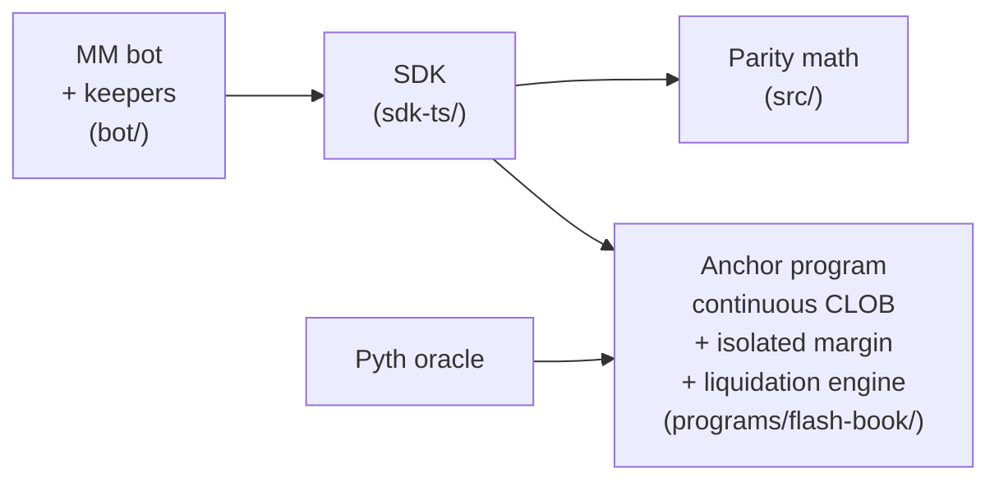

# Flash Book

A perpetual futures DEX on Solana. Open-source matcher, isolated-margin
liquidation engine, and full SDK + bot suite.

```
programs/flash-book/   on-chain Solana program (Rust + Anchor)
sdk-ts/                TypeScript client (PDA + ix builders + IDL)
bot/                   reference MM bot + keeper suite (TypeScript)
src/                   TypeScript parity ports of the on-chain risk / funding / FLP / VPIN modules
docs/                  architecture, math, comparison docs
tests/                 TypeScript test suite
```

## Status

Devnet. Not audited. Not production-ready. The deployed program ID is
`Di8ZzxmMb5Ho2xWHbvcAxKPjcaVXTCM7U5xe5Gm7uLVF` (see `Anchor.toml`).

```
cargo build-sbf                     clean
cargo test -p flash-book             211 tests pass (lib + integration + proptests)
bun test                             236 tests pass (TypeScript)
```

## Architecture at a glance



Detailed diagrams (system, account ownership, fill flow, liquidation
pipeline, Phase 2 timeline): [`docs/DIAGRAMS.md`](docs/DIAGRAMS.md).

## What this actually is

A Solana program that implements a perp orderbook with a hypertree-backed
continuous CLOB matcher, plus a risk and liquidation engine that's the
focus of the design work. The novel parts are in the margin model and the
liquidation flow, not in the matching engine itself (which is a standard
price-time-priority CLOB walk).

The TypeScript `src/` directory holds parity ports of the on-chain
risk, funding, liquidation, insurance, FLP-quoter, and VPIN modules.
They mirror the on-chain math 1:1 and are used by the SDK and by
off-chain tooling (the keepers, the bot) that needs to reproduce
the program's calculations without round-tripping to the chain. The
on-chain matcher in
`programs/flash-book/src/lib.rs::place_taker_order_v2` is continuous
CLOB that walks the opposite-side hypertree best-price-first. See
`docs/COMPARISON.md` for why continuous CLOB is the deliberate
architectural pick over FBA.

## What's actually in the on-chain matcher

Verifiable in `programs/flash-book/`:

- **Stress-lattice margin assessment** — every margin check evaluates the
  position set against a finite scenario lattice (per-market ±2/5/10/20%,
  all-up/down 10%, black-swan ±30%). Worst-case loss across all scenarios
  drives the maintenance requirement. Source: `matcher/risk.rs::assess_margin`.
- **Isolated margin with strict bucket independence** (Phase 2, this branch).
  Per-position collateral can be reserved; the cross pool cannot rescue an
  under-collateralised isolated position, and an isolated failure does not
  bleed into the cross set. Spec: `docs/MARGIN_MATH.md`. Source:
  `matcher/risk.rs::assess_margin_split` + `assess_margin_unified`.
- **Dual-source liquidation health gate** — picks `min(mark, oracle)` for
  longs / `max(mark, oracle)` for shorts. A flash-crash oracle move can
  tip a position underwater without waiting for the mark to update.
  Refuses to liquidate when the oracle is stale. Source:
  `lib.rs::liquidate_position_v2:5222`.
- **JIT liquidation auction** — any maker can pre-commit a tighter close
  price for a specific (or any) underwater trader. The synthetic close
  order uses the JIT price when it beats `oracle ± liq_penalty_bps`.
  Source: `lib.rs::place_jit_liquidation_offer`, consumed in
  `liquidate_position_v2:5495`.
- **Dutch-auction liquidator reward** — scales 0% → 100% over
  `liquidation_auction_duration_slots`. Reward routes to the per-position
  bucket on isolated positions, never to the cross pool. Source:
  `lib.rs:5468-5547`.
- **Per-position cooldown** — same position can't be liquidated twice
  within `liquidation_cooldown_slots`. Anti-cascade. Source: `lib.rs:5184`.
- **Sub-accounts with full trading capability** (Phase 2c–2f). Position
  PDAs key on the TraderState PDA so main and sub-accounts have distinct
  positions per market. Triggers, TWAPs, icebergs, brackets, and JIT
  offers all carry a `sub_index` so fills route to the right TraderState.
  Spec: `docs/SUB_ACCOUNT_TRADING.md`.
- **Tiered MMR** (Hyperliquid-pattern) — maintenance margin scales with
  position notional via the `MarketLeverageTiersAccount`. Source:
  `matcher/risk.rs::tiered_mmr_bps`.
- **Multi-oracle quorum** — `update_oracle_quorum` accepts 3 prices, takes
  the median, rejects if dispersion exceeds
  `oracle_quorum_max_dispersion_bps`. Source: `lib.rs:3446-3530`.
- **Funding accrual via cumulative index** — `cum_funding_index` advances
  per block; settled lazily by a permissionless `settle_funding` ix. On
  isolated positions, funding routes to the per-position bucket. Source:
  `lib.rs::settle_funding`.
- **Per-market kill switch** — `verify_market_invariants` checks documented
  solvency invariants and can auto-pause the market on breach. Source:
  `lib.rs::verify_market_invariants`.
- **Auto-deleverage** — bankruptcy-price math against a ranked counter
  position when insurance fund is below the pause threshold. Source:
  `lib.rs::auto_deleverage`.

## What this is NOT

Called out explicitly so they're not mistaken for shipping features:

- **No mainnet deployment.** Devnet only.
- **No independent security audit.** See `docs/AUDIT_READINESS.md`
  for the hand-off doc.
- **No HLP-style dedicated backstop vault.** The FLP is an LP pool,
  not a liquidator vault. The JIT-liquidation auction is the closest
  analogue but is opportunistic, not always-on. Planned for v0.5.0;
  spec at `docs/HLP_BACKSTOP_VAULT.md`.
- **No FBA / Walrasian clearing.** Continuous CLOB on a hypertree is
  the deliberate architectural pick. Not coming.
- **No commit-reveal.** Same — Solana's threat model doesn't make it
  worth the latency cost. Not coming.

See `docs/COMPARISON.md` for an honest head-to-head with Hyperliquid,
Drift, dYdX v4, GMX v2, and Phoenix, including a detailed
"design choices the project has NOT made" section.

## Quick start

Build and test:

```bash
cargo build-sbf --manifest-path programs/flash-book/Cargo.toml
cargo test -p flash-book
```

TypeScript SDK + parity modules:

```bash
bun install
bun test                              # 236 tests
bun run --cwd sdk-ts typecheck        # strict TS check
```

Generate the IDL after on-chain changes:

```bash
anchor idl build -p flash_book > sdk-ts/idl.json
```

## SDK usage

```ts
import { Connection, Keypair, PublicKey } from '@solana/web3.js';
import { AnchorProvider, Wallet } from '@coral-xyz/anchor';
import { FlashBookClient } from '@flash-book/sdk';

const connection = new Connection('https://api.devnet.solana.com');
const provider = new AnchorProvider(connection, new Wallet(Keypair.generate()), {});
const client = new FlashBookClient(provider);

// Place a limit order on the main account.
const ix = await client.placeLimitOrderV2Ix({
  trader: wallet.publicKey,
  market: solPerpMarket,
  side: 'long',
  sizeLots: 10n,
  limitTicks: 95_000n,
});

// Same, but from sub-account index 1.
const subIx = await client.placeLimitOrderV2Ix({
  trader: wallet.publicKey,
  market: solPerpMarket,
  side: 'long',
  sizeLots: 10n,
  limitTicks: 95_000n,
  subIndex: 1,
});

// Switch a position to isolated margin.
const isoIx = await client.setPositionIsolatedIx({
  trader: wallet.publicKey,
  market: solPerpMarket,
  amountQuoteLots: 5_000n,
  otherPositions: [],  // pass other (market, position) pairs for the health check
});
```

Full helper list: `sdk-ts/src/client.ts`.

## Repo layout

```
programs/flash-book/        Anchor program (Rust)
  src/
    lib.rs                  Instruction handlers + Accounts contexts
    state.rs                Persistent account types (V1)
    state_v2.rs             V2 hypertree + RestingOrderV2
    state_v3.rs             V3 state (TriggerOrder, TWAP, Iceberg, JIT, Vault)
    matcher/
      risk.rs               Stress-lattice margin + isolated-margin split
      liquidation.rs        Detection + synthetic-close generation
      funding.rs            Cumulative funding index
      flp_quoter.rs         Virtual FLP quoter ladder
      insurance.rs          Insurance fund waterfall
      vpin.rs               Volume-synchronized toxicity signal
      v2_bookkeeping.rs     Mark TWAP + EMA blend
      lot.rs                Type-safe lot/tick/bps wrappers
      order.rs              Order, side, type primitives
      tests.rs              Unit tests
  tests/
    integration.rs          On-chain integration tests (34 tests)
    proptest_risk.rs        Cross-margin proptests
    proptest_isolated.rs    Isolated-margin proptests (Phase 2)
    proptest_liquidation.rs Liquidation proptests
    proptest_new_features.rs

sdk-ts/                     TypeScript client
  src/
    client.ts               FlashBookClient with all ix builders
    pdas.ts                 Canonical PDA derivations
    events.ts               Event decoders
    errors.ts               Error code enum
  idl.json                  Generated Anchor IDL

bot/                        Reference MM bot + keeper suite
  src/
    bot.ts                  MultiMarketBot
    keepers.ts              LiquidationKeeper, FundingKeeper, etc.
    discovery.ts            getProgramAccounts-based account scanner
    smart-router.ts         V2 + V3 smart router
    order-types.ts          OCO / Iceberg / Trailing stop (off-chain)
    backtester.ts           Replay tape through a Strategy
    telemetry.ts            Prometheus push
    hot-config.ts           Param hot-reload

src/                        TypeScript parity ports of on-chain modules
  flp-quoter.ts             FLP quoter port
  funding.ts                Funding port
  risk.ts                   Risk port
  insurance.ts              Insurance port
  liquidation.ts            Liquidation port
  vpin.ts                   VPIN port
  math.ts                   Helpers (PRNG, clamp, banding)
  types.ts                  Domain types

docs/
  ARCHITECTURE.md           System design + account lifecycle
  COMPARISON.md             vs HL / Drift / dYdX v4 / GMX v2 / Phoenix
  MARGIN_MATH.md            Formal margin model (cross + isolated, Phase 2)
  SUB_ACCOUNT_TRADING.md    Phase 2c–2f scope + design rationale
  INSTRUCTIONS.md           Per-ix reference
  MATH.md                   Clearing, FLP quoter, funding, mark blend
  SAFETY.md                 Solvency invariants + threat model
  DEPLOYMENT.md             Devnet deployment runbook
  KEEPER_RUNBOOK.md         Keeper operation
  LP_GUIDE.md               LP deposit/withdraw flow
  MM_TUNING.md              Bot parameter tuning
  ROADMAP.md                Staged path forward
```

## Tests

```
cargo test -p flash-book
  100 lib unit tests
  34  integration tests
  6   isolated-margin proptests   (2000 random cases each)
  6   risk proptests              (2000 random cases each)
  14  module proptests
  19  new-features proptests
  7   liquidation proptests
  ----
  186 total
```

```
bun test
  236 tests across 28 files
```

Together: 447 tests, all green at HEAD.

## Documentation

The single load-bearing documents:

- [`docs/DIAGRAMS.md`](docs/DIAGRAMS.md) — system / account / fill /
  liquidation / Phase 2 timeline diagrams (Mermaid).
- [`docs/COMPARISON.md`](docs/COMPARISON.md) — head-to-head with the
  major perp DEXes. Honest about where Flash Book wins and where it
  doesn't.
- [`docs/MARGIN_MATH.md`](docs/MARGIN_MATH.md) — formal margin model.
  Equity, MMR, stress lattice, isolated bucket invariants. Written
  audit-grade.
- [`docs/SUB_ACCOUNT_TRADING.md`](docs/SUB_ACCOUNT_TRADING.md) — the
  Phase 2c–2f sub-account work; scope, design choices, what's done vs
  what's pending.
- [`docs/ARCHITECTURE.md`](docs/ARCHITECTURE.md) — system overview.
- [`docs/INSTRUCTIONS.md`](docs/INSTRUCTIONS.md) — every Anchor ix with
  account layout.

## Contributing

Standard GitHub flow. Open an issue first for non-trivial changes. All
tests must pass (`cargo test -p flash-book` + `bun test` + `bun run
--cwd sdk-ts typecheck`). Anchor IDL is regenerated as part of every
program change.

The on-chain program is built with Anchor 0.32.x. Rust toolchain pinned
via `rust-toolchain.toml`.

## Acknowledgements

The on-chain risk
engine borrows from CME SPAN (stress-lattice margin), Hyperliquid
(tiered MMR + isolated margin), and standard CEX practice (insurance
fund + ADL waterfall). VPIN is from Easley, López de Prado, O'Hara. The
FLP quoter spread function is Avellaneda-Stoikov style.

## License

MIT — see [LICENSE](LICENSE).
