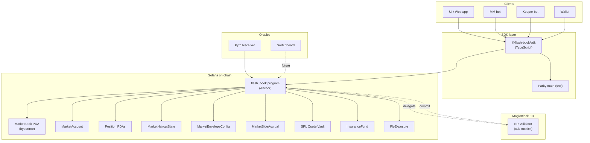
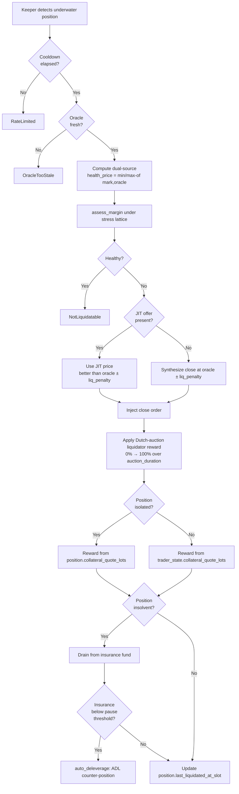
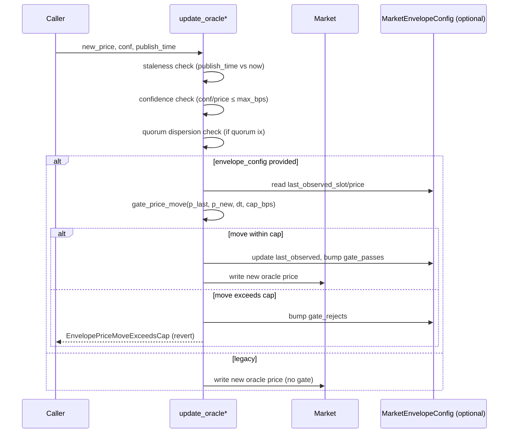

# Flash Book — System Architecture

End-to-end architecture diagrams covering every subsystem added across
Waves 18–65.

---

## 1. System landscape



---

## 2. Account ownership tree

```text
                       ┌─────────────────────────┐
                       │ Market authority signer │
                       └──────────┬──────────────┘
                                  │ inits
                                  ▼
┌─────────────────────────────────────────────────────────────────┐
│                   MarketAccount (per market)                    │
│  seeds: [b"market", base_mint, quote_mint]                      │
│  fields: authority, params, oracle_*, oi_*, mark_*, status      │
└──┬──────────────────────────────────────────────────────────────┘
   │
   ├──► MarketBook (hypertree)  [b"market_book", market]
   ├──► MarketHaircutState      [b"haircut", market]
   ├──► MarketSideAccrual       [b"side_accrual", market]
   ├──► MarketEnvelopeConfig    [b"envelope", market]
   ├──► MarketLeverageTiers     [b"leverage_tiers", market]
   ├──► MarketOracleConfig      [b"oracle_config", market]
   ├──► CommitBuffer            [b"commit_buffer", market]
   │
   └──► Position PDAs (per trader, per market)
                seeds: [b"position", market, trader_state]
                ├──► PositionHaircutState  [b"position_haircut", market, position]
                └──► Sibling triggers / TWAPs / brackets / iceberg orders

                       ┌──────────────────────────┐
                       │ InsuranceFundAccount     │  [b"insurance_fund"]
                       │ (singleton, owns vault)  │
                       └───────────┬──────────────┘
                                   │ owns
                                   ▼
                            ┌───────────────┐
                            │ Quote Vault   │  (SPL TokenAccount)
                            └───────────────┘
                                   ▲
                                   │
                       ┌───────────┴──────────────┐
                       │ FlpExposureAccount       │  [b"flp_exposure"]
                       │ (singleton, NAV shares)  │
                       └──────────────────────────┘

                       ┌──────────────────────────┐
                       │ TraderStateAccount       │  [b"trader_state", wallet[, sub]]
                       │ (per wallet × sub_index) │
                       └──────────────────────────┘
```

---

## 3. Fill flow (apply_fill, post-Wave 24d)

```mermaid
sequenceDiagram
    participant Taker
    participant Matcher as place_taker_order_v2
    participant Book as MarketBook (hypertree)
    participant Seq as Sequencer (off-chain)
    participant ApplyFill as apply_fill
    participant TakerPos as Taker Position
    participant MakerPos as Maker Position
    participant Haircut as Haircut State (optional)
    participant Trader as TraderState collateral

    Taker->>Matcher: place_taker_order_v2(side, size, limit)
    Matcher->>Book: walk opposite-side book
    Book-->>Matcher: candidate matches
    Matcher->>Matcher: STP check (skip / cancel-oldest / cancel-both)
    Matcher->>Book: update maker order sizes
    Matcher->>Seq: emit FillBatchEvent (Vec&lt;FillEntry&gt;)
    
    loop per FillEntry
        Seq->>ApplyFill: apply_fill(taker, maker, size, price)
        ApplyFill->>ApplyFill: snapshot pre-state (sides, sizes, realized)
        ApplyFill->>ApplyFill: charge taker fee + maker rebate (isolated/cross routing)
        ApplyFill->>TakerPos: apply_fill_to_position (weighted avg or close-with-PnL)
        ApplyFill->>MakerPos: apply_fill_to_position
        
        alt Positive PnL delta AND haircut accounts provided
            ApplyFill->>Haircut: apply_release(gain) → reserve += gain
            Note over Haircut: NO collateral mutation
        else Legacy / loss
            ApplyFill->>Trader: apply_realized_pnl_delta (direct)
        end
        
        ApplyFill->>ApplyFill: update OI counters
        ApplyFill->>ApplyFill: blend fill price into mark EMA (clamped)
        ApplyFill-->>Seq: FillAppliedEvent
    end
```

---

## 4. H-haircut lifecycle (Wave 24)

```text
Fill realizes positive PnL
        │
        ▼  apply_release(gain, now_slot)
┌──────────────────────────────────────────┐
│  Position.released_reserve += gain       │
│  attached_at_slot = first-add slot       │
│  original_reserve_at_attach += gain      │
└──────────────────────────────────────────┘
        │
        │  warmup [h_min, h_max] slots
        │  (linear ramp; old reserves keep clock)
        ▼  mature_position()  (permissionless keeper crank)
┌──────────────────────────────────────────┐
│  target_cumulative =                     │
│    matured_fraction(original, attached,  │
│      now, h_min, h_max)                  │
│  delta = target - already_drained        │
│  reserve   -= delta                      │
│  matured   += delta                      │
│  market.matured_pos_total += delta       │
└──────────────────────────────────────────┘
        │
        ▼  convert_position()  (permissionless)
┌──────────────────────────────────────────┐
│  h = min(Residual, MaturedTotal) / Total │
│  credit = floor(matured × h)             │
│  dust   = matured - credit               │
│  collateral += credit  (iso or cross)    │
│  market.residual -= credit               │
│  market.dust_accrued += dust             │
│  market.matured_pos_total -= matured     │
└──────────────────────────────────────────┘
        │
        ▼  flush_haircut_dust()  (permissionless)
┌──────────────────────────────────────────┐
│  insurance.balance += dust_accrued       │
│  market.dust_accrued = 0                 │
└──────────────────────────────────────────┘
```

---

## 5. Liquidation pipeline



---

## 6. Oracle update + envelope gate (Wave 26b)



---

## 7. A/K/F/B settlement (Wave 25 helpers, wire-in Wave 25c queued)

```text
Per side (long, short):
  A — ADL multiplier (starts at ADL_ONE = 10^15)
  K — Mark-price accumulator (signed)
  F — Funding accumulator (signed)
  B — Bankruptcy residual (signed)

On every settle_funding tick (Wave 25c):
  ┌────────────────────────────────────────┐
  │ advance_indices(side, p_new, fr, now)  │
  │   dt = now - side.slot_last            │
  │   K += dp × A                          │
  │   F += p_last × fr × dt × A            │
  │   side.slot_last = now                 │
  │   side.price_last = p_new              │
  └────────────────────────────────────────┘

On every Position touch:
  ┌────────────────────────────────────────┐
  │ settle_position_pnl(basis, side, snap) │
  │   k_delta = (K - k_snap)               │
  │   f_delta = (F - f_snap)               │
  │   pnl = basis × (k_delta - f_delta)    │
  │         × sign / (a_snap × POS_SCALE)  │
  │ → credit/debit collateral              │
  │                                        │
  │ refresh_position_snapshot(pos, side)   │
  │   pos.a_snap = side.a                  │
  │   pos.k_snap = side.k                  │
  │   pos.f_snap = side.f                  │
  │   pos.b_snap = side.b                  │
  └────────────────────────────────────────┘

ADL via reduce_a_pro_rata(side, num, den):
  All opposing positions auto-shrink by num/den
  on their next touch (via `effective_lots`).

Side state machine (Wave 25a):
  Normal --A<MIN_A_SIDE--> DrainOnly --OI=0--> ResetPending
       ^                                                |
       └──── epoch_advance(side) ───────────────────────┘
```

---

## 8. Permissionless keeper crank schedule

```text
Per market, per N seconds:
  every 30s   verify_haircut_invariants(market)
  every 30s   verify_envelope_config(market)
  every 60s   verify_protocol_solvency()              (singleton)
  every 60s   verify_market_invariants(market)
  every 5min  flush_haircut_dust(market)

Per position:
  on warmup elapse   mature_position(market, position)
  when matured > 0   convert_position(market, position)

Underwater detection:
  always-on    liquidate_position_v2 / liquidate_portfolio_v2

Trigger / TWAP execution:
  on oracle X  execute_trigger_order_v3
  on schedule  execute_twap_slice_v3
  on schedule  replenish_iceberg_v2

Oracle update:
  every slot   update_oracle_from_pyth (per market)
```

See [`docs/KEEPER_RUNBOOK.md`](KEEPER_RUNBOOK.md) for the production
cron + monitoring + alerting playbook.
