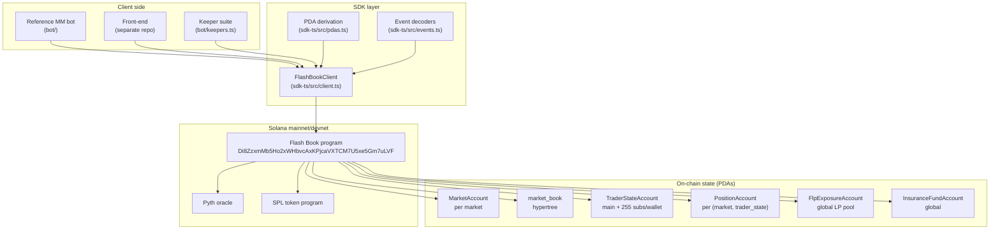
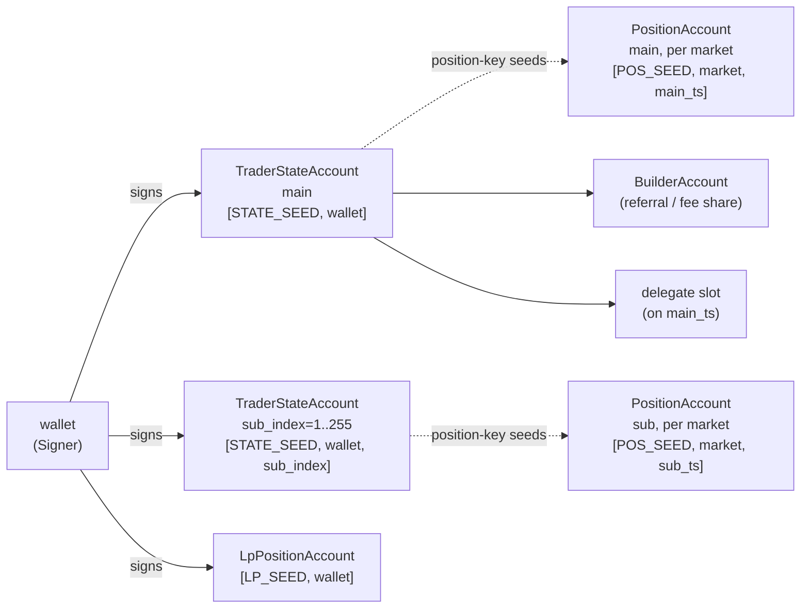
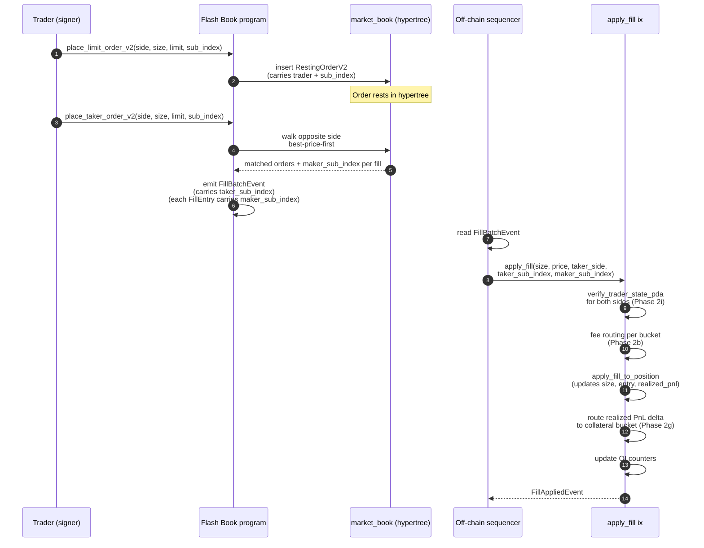
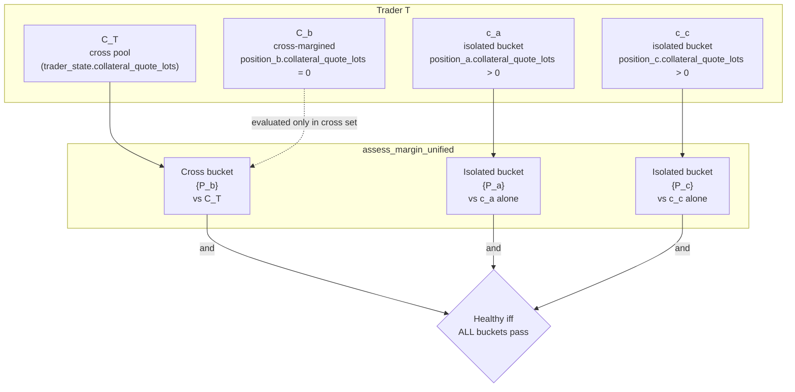
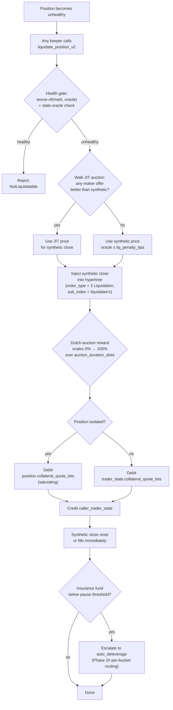
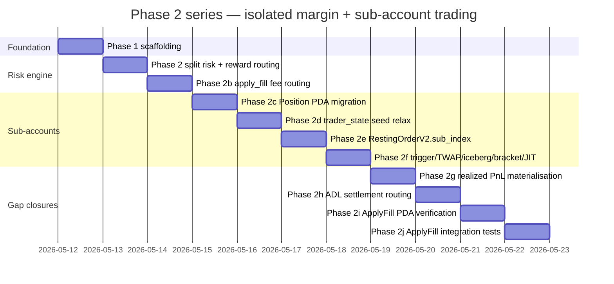
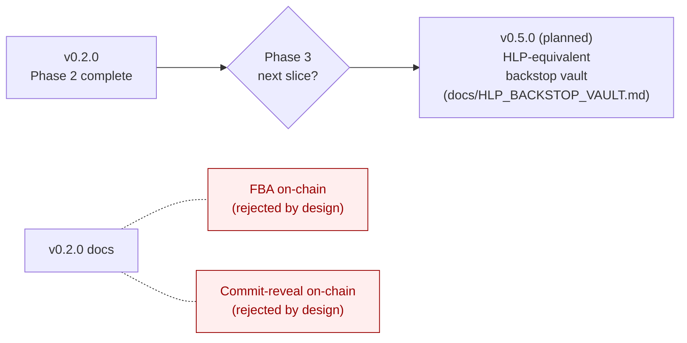
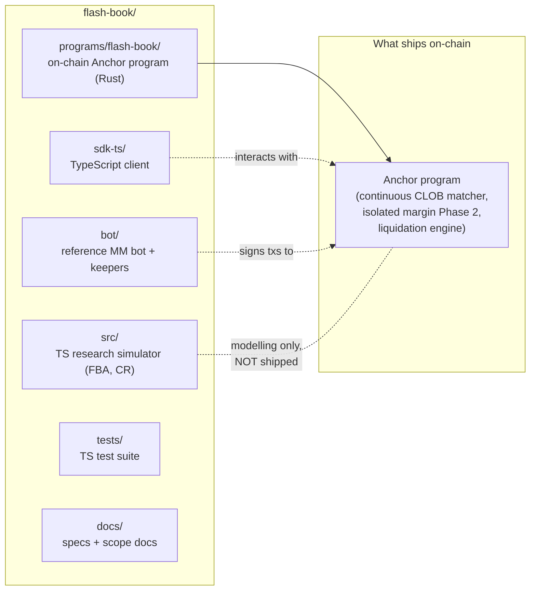

# Architecture Diagrams

All diagrams are [Mermaid](https://mermaid.js.org/) — GitHub renders
them natively when you open this file on github.com. Source-controlled
as text so they update with the code.

## 1. System overview

## 2. Account / PDA ownership tree

Each TraderStateAccount has its own positions per market. Phase 2c made
this strict — Position PDAs key on the trader_state pubkey, so main +
sub-accounts on the same wallet have distinct positions per market. This
is what makes risk-isolation between main and sub mechanically guaranteed.

## 3. Order placement → fill → settlement flow

## 4. Cross-margin vs isolated-margin bucket independence (Phase 2)

Invariant I-3: an isolated bucket failure cannot bleed into C_T.
Invariant I-4: a cross-set failure cannot debit any c_m.

## 5. Liquidation pipeline

## 6. Phase 2 series — what shipped in v0.2.0

Released as `v0.2.0` on `2026-05-14`.

## 7. Phase 3 / future work (NOT in v0.2.0)

Continuous CLOB on-chain is the deliberate architectural pick.
FBA / commit-reveal stay research-only in `src/`. See
`docs/COMPARISON.md` for the rationale.

## 8. Layout — where each thing lives in the repo

